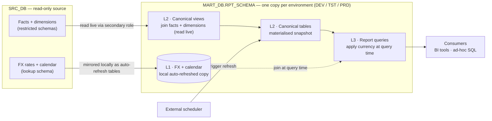
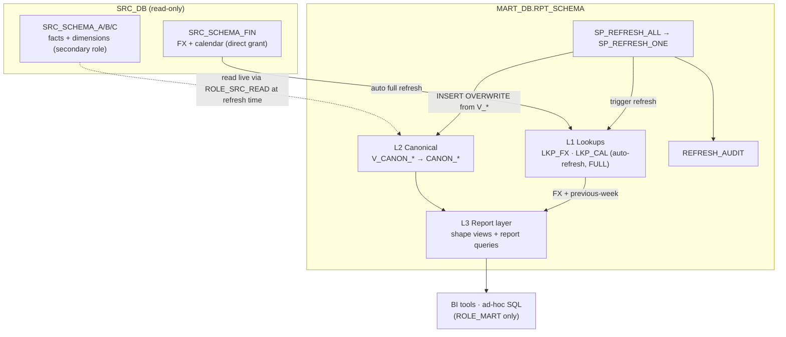
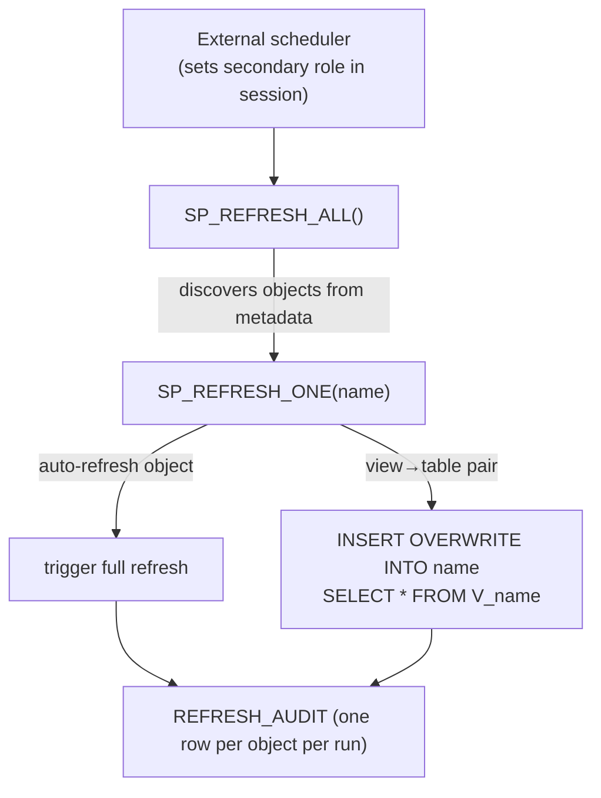
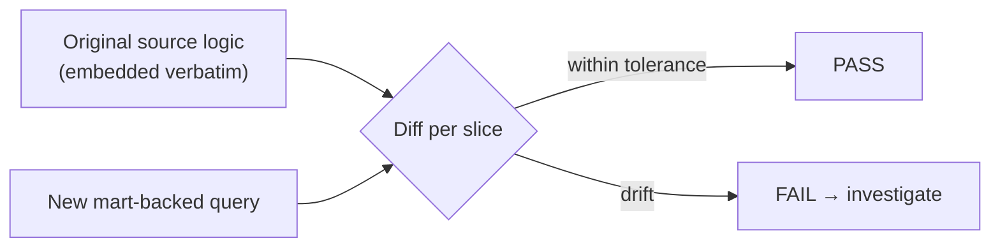

# Governed Reporting Data Mart on Snowflake

> A code-first, governed Snowflake data mart that re-platforms legacy BI reports
> onto canonical, parity-validated SQL models, with query-time currency
> conversion and an automated refresh + audit pipeline.

> **Portfolio note.** This document describes a production data-engineering system
> I designed and built. Organisation-, database-, schema-, table-, role-, and
> warehouse-specific names have been replaced with neutral placeholders
> (`SRC_DB`, `MART_DB`, `RPT_SCHEMA`, `CANON_REVENUE`, …). The architecture,
> patterns, and trade-offs are unchanged.

---

## 1. Problem & goals

A finance organisation ran dozens of certified reports in a legacy BI platform
whose logic was locked inside a GUI: opaque, hard to govern, and costly to
change. This system re-platforms those reports onto a governed Snowflake mart
defined entirely in version-controlled SQL. Many wide source facts are
consolidated onto a small set of canonical tables, and every figure stays
traceable to the source through automated parity validation.

**Scope:** ~5 reporting domains, ~40 reports, 8 canonical models, and an automated
refresh + audit pipeline. Built on Snowflake and SQL; all logic version-controlled
in Git.

| Goal | How the design delivers it |
|---|---|
| **1:1 fidelity** with the legacy reports | Each report has a parity script that diffs it against the original source logic |
| **Governed single source of truth** | All logic in Git; one reporting schema per environment; read-only source |
| **Performance & cost control** | The heavy joins are materialised once; currency conversion is deferred to query time |
| **Self-service** | Consumers read clean governed tables with no elevated privileges |
| **Operability** | One convention-driven refresh procedure, environment isolation, and a per-run audit log |

**Non-goals:** no write-back to the source; no real-time streaming (reporting is
daily/weekly); no per-report bespoke pipelines.

---

## 2. Naming legend (placeholders)

| Placeholder | Real-world role |
|---|---|
| `SRC_DB` | Read-only enterprise source database (data-share / BYOD style) |
| `SRC_SCHEMA_FIN` | Source schema holding FX-rate + calendar lookups (direct read grant) |
| `SRC_SCHEMA_A/B/C` | Source fact + dimension schemas (Revenue, Project, Accounting), restricted access |
| `MART_DB` | The mart database, one copy per environment (`_DEV` / `_TST` / `_PRD`) |
| `RPT_SCHEMA` | The single reporting schema inside `MART_DB` |
| `CANON_*` | Canonical fact tables (e.g. `CANON_REVENUE`, `CANON_WINS`) |
| `V_*` / `VS_*` | Canonical views / report "shape" views |
| `LKP_FX`, `LKP_CAL` | Local FX-rate and calendar lookup tables |
| `ROLE_MART` | Role that owns and reads the mart objects |
| `ROLE_SRC_READ` | Secondary role; the only path to read the restricted source schemas |
| `WH_LOAD` | Compute warehouse used for refresh and loads |
| `FN_FX(amount, rate)` | Currency-conversion UDF |
| `SP_REFRESH_ALL` / `SP_REFRESH_ONE` | Refresh orchestration procedures |
| `REFRESH_AUDIT` | Refresh audit-log table |

---

## 3. Architecture & design

The mart sits between a restricted read-only source and the reporting consumers.
It exposes three layers inside a single schema, replicated per environment.

Only two things physically land in the mart: the materialised canonical tables (a
snapshot of each canonical view) and a local copy of the FX/calendar lookups. The
source facts are read live, never duplicated, and currency conversion happens at
report time rather than in storage.

| Layer | Holds | Built by | Grain |
|---|---|---|---|
| **L1 Lookups** | FX + calendar, mirrored locally | Self-refreshing tables (full refresh) | source rows |
| **L2 Canonical** | 8 view→table pairs, one per source fact | Refresh procedure (`INSERT OVERWRITE … SELECT * FROM V_*`) | source fact grain |
| **L3 Report** | Shape views + report queries | `CREATE VIEW` / consumer SQL | report grain |

**Design invariants**

- Canonicals stay at source fact grain; all dimension joins are 1:1, so row count equals the fact.
- Measures are stored currency-agnostic (suffix `_SRC`); FX is applied by consumers, never materialised, so one lean canonical serves any target currency.
- Shape views are projection-only (no filters, no FX) and keep the source currency in the grain.
- Consumers read only `RPT_SCHEMA`, so no consumer needs the secondary role.
- Each environment owns a full, independent copy; there is no cross-environment coupling.

Each canonical is a **view + table pair**: the view carries the join logic and is
the re-runnable refresh query; the table is the materialised snapshot consumers
read. A canonical cannot be a self-refreshing object because it reads source
schemas reachable only through a secondary role, and Snowflake's automatic-refresh
mechanisms ignore secondary roles (see §4). The views also **aggregate the slim
fact on its foreign keys before joining dimensions**, which keeps the wide payload
out of the join and holds the table at fact grain.

### Why an owned, materialised layer

The source exposes only secure views: read-only, and reachable solely through a
secondary role. That removes most of the levers needed for performance,
evolution, and stability. Materialising into a schema we own converts that opaque
dependency into governed, tunable assets, and is the primary justification for the
design.

| Dimension | Reading source secure views | Owning the canonical layer |
|---|---|---|
| Access | Read-only `SELECT`; no DDL | Full ownership: DDL, grants, retention |
| Physical tuning | None (no clustering, no write-ordering) | Cluster keys, load ordering, pre-aggregation |
| Refresh model | Incremental/auto-refresh impossible (no change tracking; secondary-role) | Procedure-materialised with snapshot semantics |
| Stability | Live reads exposed to upstream change mid-query | Atomic snapshot per refresh; reproducible reporting |
| Access path | Reachable only via the secondary role | Consumers read plain tables; no elevated role |

Owning the layer also makes the physical design deliberate: cluster keys and load
ordering are chosen from the columns reports actually filter (scenario, fiscal
year, posting/week dates) so Snowflake prunes micro-partitions; the heavy
multi-dimension join is computed once per refresh and amortised across every
report; and deferring FX avoids a combinatorial storage blow-up. None of this is
possible when reading the source secure views directly.

---

## 4. Data flow & access model

Source data reaches the mart through **two mechanisms**, each dictated by how the
source can be read:

| Object set | Source | Mechanism | Refresh |
|---|---|---|---|
| **Local lookups** (FX, calendar) | direct read grant | self-refreshing tables | platform scheduler (full) |
| **Canonical tables** | restricted fact/dim schemas (secondary role) | view materialised via `INSERT OVERWRITE` by a procedure | `SP_REFRESH_ALL` |

The role boundary is the single most influential constraint on the design. The
refresh session activates `ROLE_SRC_READ` as a **secondary role** to read the
restricted source; the materialised write is done by `ROLE_MART`, which owns
`RPT_SCHEMA`. Because the consumer layer reads only the materialised tables and
the local lookups, **consumers never need the secondary role** — the cross-boundary
read is confined to refresh time. The owning role also lacks `ALTER` on the source
lookups, so change tracking cannot be enabled and the lookup tables refresh in
full rather than incrementally.

---

## 5. Refresh & orchestration

- `SP_REFRESH_ALL` discovers every refreshable object from metadata at runtime, so
  a new canonical registers simply by following the `V_<name>` + `<name>`
  convention, with no change to the orchestration code.
- `SP_REFRESH_ONE(name)` refreshes a single object for partial recovery or debugging.
- Every run writes an audit row (object, tier, timing, row count, status, error,
  invoked-by) to `REFRESH_AUDIT`.
- Scheduling is **external**: the owning role lacks task privileges and tasks
  ignore secondary roles, so the refresh runs from an orchestrator that sets the
  secondary role in-session. Moving to native scheduling is a one-line change if
  the privilege is granted.

---

## 6. External file ingestion

Some datasets arrive as periodic external files (for example a CRM extract or an
HR matrix) rather than from the governed source. These take a separate,
client-driven path, independent of the canonical refresh.

- **All-text landing** so a malformed or blank value never fails the load; types are applied in the view.
- **Full replace** (truncate + copy) preserves grants and downstream access across reloads.
- A **single generic loader** derives the column list from the table definition, so a new file dataset needs only a table and a view, not new load code.

---

## 7. Quality & validation

Every report ships with a parity script that runs the original source logic and
the new mart-backed query side by side and emits a PASS/FAIL per slice (for
example, per fiscal year). This makes "1:1 with the legacy report" a checkable
property rather than an assertion, and it doubles as a regression guard whenever a
canonical changes.

