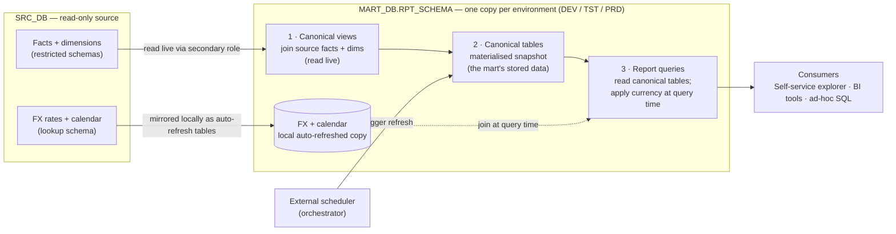
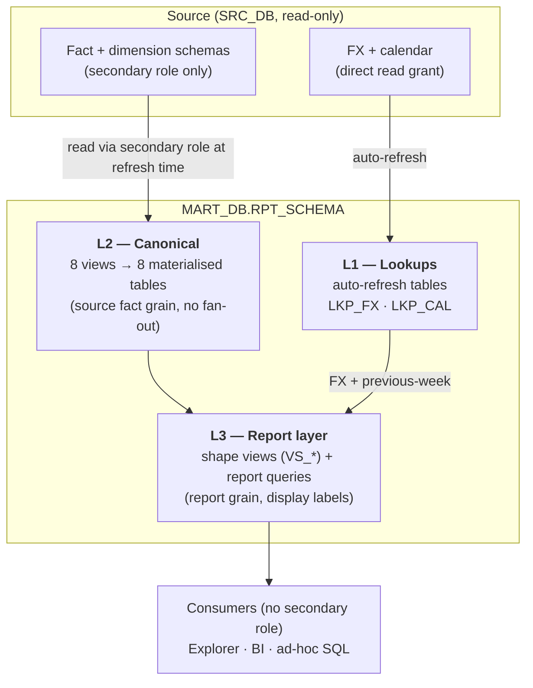
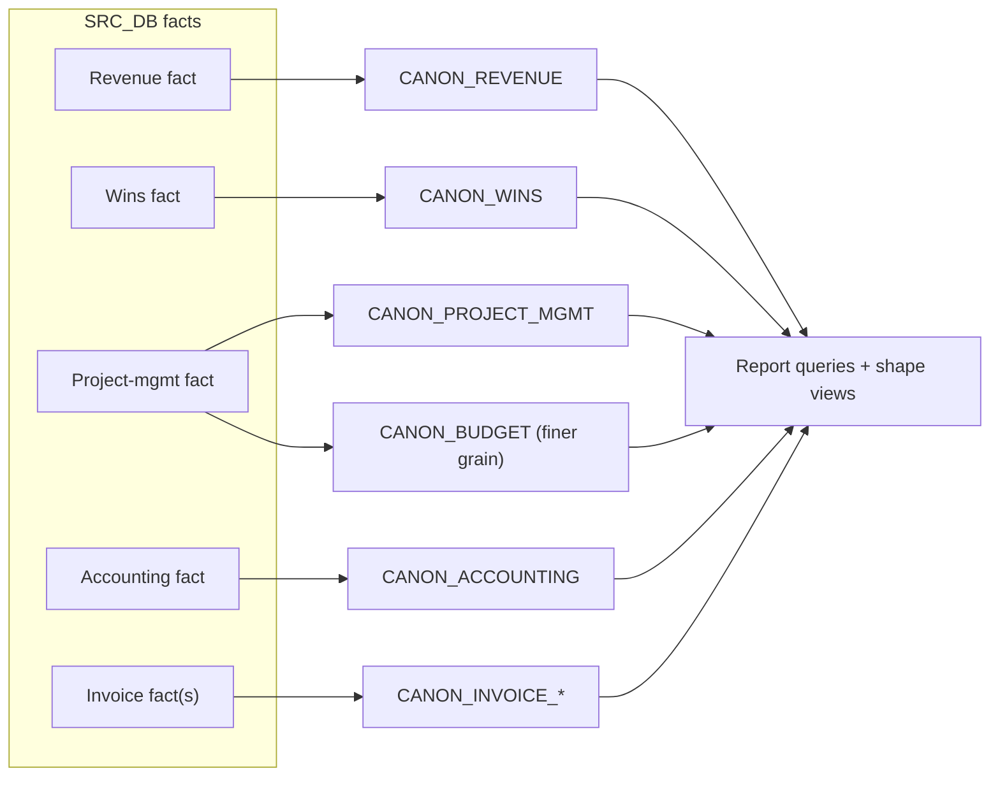
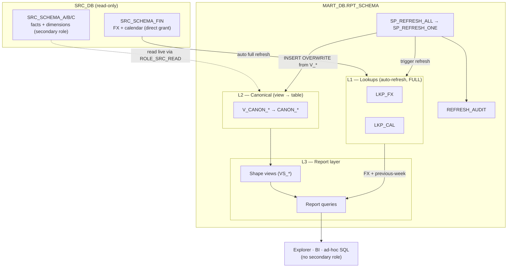
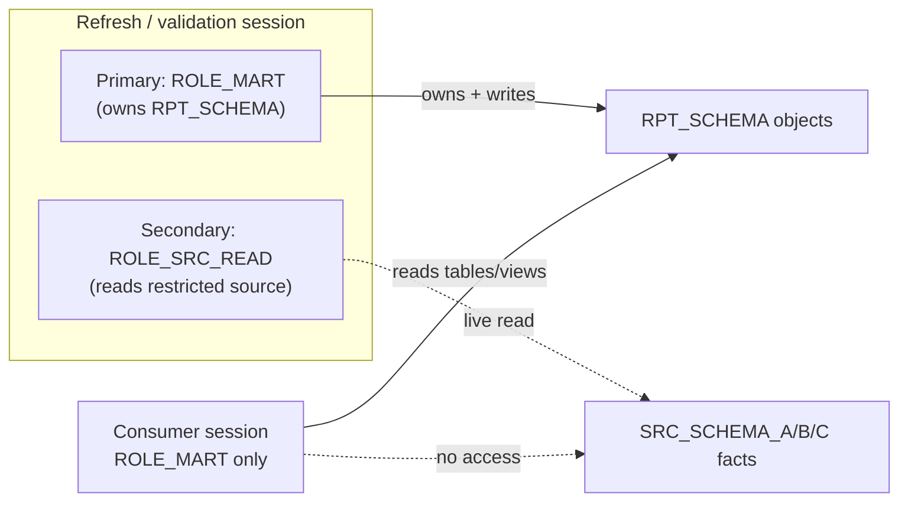
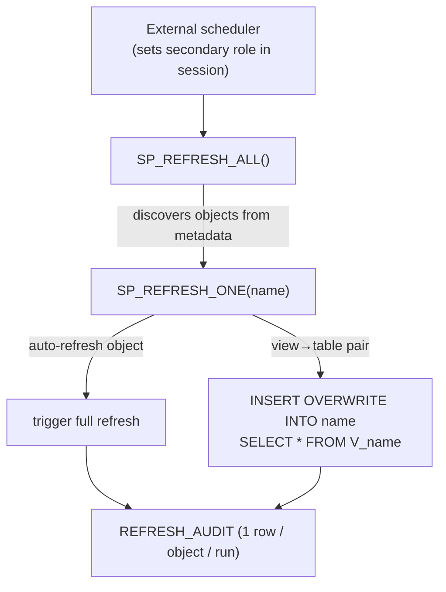
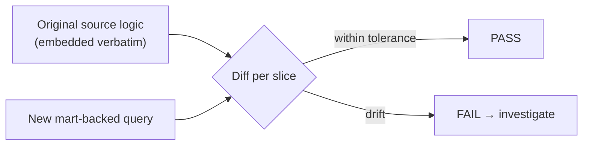

# Governed Reporting Data Mart on Snowflake

> A code-first, governed Snowflake data mart that re-platforms legacy BI reports
> onto canonical, parity-validated SQL models — with query-time currency
> conversion and an automated refresh + audit pipeline.

> **Portfolio note.** This document describes a production data-engineering
> system I designed and built. All organisation-, database-, schema-, table-,
> role-, and warehouse-specific names have been replaced with neutral
> placeholders (`SRC_DB`, `MART_DB`, `RPT_SCHEMA`, `CANON_REVENUE`, …). The
> architecture, patterns, and trade-offs are unchanged.

---

## 1. Summary

A **governed, version-controlled reporting data mart on Snowflake** that
re-platforms a large suite of certified finance reports off a legacy BI tool and
onto auditable SQL. The mart consolidates many wide source facts onto a small set
of **canonical tables**, exposes them to consumers through thin report queries
and a self-service explorer app, and keeps every figure **traceable back to the
source system** through automated parity validation.

**Scope:** ~5 reporting domains, ~40 reports, 8 canonical models, a self-service
explorer, and an automated refresh + audit pipeline — all defined as code in Git.

---

## 2. Problem & goals

A finance organisation depended on dozens of certified reports built in a legacy
BI platform. That platform was opaque (logic locked in a GUI), hard to govern,
and expensive to change. The goal was to reproduce those reports **exactly** on a
modern, governed, code-first stack without disrupting consumers.

| Goal | How it shows up in the design |
|---|---|
| **1:1 fidelity** with the legacy reports | Every report has a parity-validation script that diffs it against the original source logic |
| **Single source of truth, governed** | All logic in Git; one mart schema per environment; read-only source |
| **Performance & cost control** | Heavy joins materialised once; currency conversion deferred to query time |
| **Self-service** | Consumers read clean tables/views with no special privileges |
| **Operable** | One generic refresh procedure + an audit log; environment isolation |

**Non-goals:** no write-back to the source; no real-time streaming (reporting is
daily/weekly); no per-report bespoke pipelines.

---

## 3. Naming legend (placeholders)

| Placeholder | Real-world role |
|---|---|
| `SRC_DB` | Read-only enterprise source database (data-share / BYOD style) |
| `SRC_SCHEMA_FIN` | Source schema with FX-rate + calendar lookups (direct read grant) |
| `SRC_SCHEMA_A/B/C` | Source fact + dimension schemas (Revenue, Project, Accounting) — restricted access |
| `MART_DB` | The mart database (one copy per environment: `_DEV` / `_TST` / `_PRD`) |
| `RPT_SCHEMA` | The single reporting schema inside `MART_DB` |
| `CANON_*` | Canonical fact tables (e.g. `CANON_REVENUE`, `CANON_WINS`) |
| `V_*` / `VS_*` | Canonical views / report "shape" views |
| `LKP_FX`, `LKP_CAL` | Local FX-rate and calendar lookup tables |
| `ROLE_MART` | Role that owns and reads mart objects |
| `ROLE_SRC_READ` | Secondary role — the only path to read restricted source schemas |
| `WH_LOAD` | Compute warehouse for refresh/load |
| `FN_FX(amount, rate)` | Currency-conversion UDF |
| `SP_REFRESH_ALL` / `SP_REFRESH_ONE` | Refresh orchestration procedures |
| `REFRESH_AUDIT` | Refresh audit-log table |

---

## 4. High-level architecture (context)

What the mart is, who feeds it, who consumes it.



Only two things physically land in the mart: the materialised canonical tables
(a snapshot of each canonical view) and a local copy of the FX/calendar lookups.
Source facts are read live, never duplicated, and currency conversion happens at
report time rather than in storage.

| Concern | Approach |
|---|---|
| Source of truth | `SRC_DB` (read-only); the mart never writes back |
| Boundary | one schema, `RPT_SCHEMA`, replicated per environment |
| Consumption | self-service explorer + BI/SQL, all reading governed tables |
| Operations | refresh driven by an external scheduler; every run audited |

---

## 5. Layered design



| Layer | What it holds | Built by | Grain |
|---|---|---|---|
| **L1 Lookups** | FX + calendar, mirrored locally | Self-refreshing tables (full refresh) | source rows |
| **L2 Canonical** | 8 view→table pairs, one per source fact | Refresh procedure (`INSERT OVERWRITE … SELECT * FROM V_*`) | source fact grain |
| **L3 Report** | Shape views + report queries | `CREATE VIEW` / consumer SQL | report grain |

**Design invariants**

- Canonicals stay at **source fact grain**; all dimension joins are 1:1 (row count = fact).
- Measures are stored **currency-agnostic** (suffix `_SRC`); FX is applied by consumers, never materialised.
- Shape views are **projection-only** (no filters, no FX) and keep the source currency in the grain.
- The consumer layer reads **only** `RPT_SCHEMA` — so it needs no elevated privileges.
- Each environment owns a **full, independent copy** (no cross-environment coupling).

---

## 6. Canonical model

Each reporting domain is consolidated onto **one canonical** — a view that holds
the join/transform logic, materialised into a table the consumers read.



Two facts that wrap the **same source** at **different grains** are kept as
**separate canonicals** rather than one — collapsing them would either fan out
rows or bloat a table the slimmer reports don't need. This was a deliberate
cardinality-driven split.

### Why a view *and* a table per canonical

| Object | Role |
|---|---|
| `V_<canonical>` (view) | The join logic **and** the re-runnable refresh query. Single source of truth for shape. |
| `<canonical>` (table) | A materialised snapshot consumers read, rebuilt by `INSERT OVERWRITE … SELECT * FROM V_<canonical>`. |

The canonical **cannot** be a self-refreshing object because it reads restricted
source schemas reachable only through a **secondary role**, and Snowflake's
automatic refresh mechanisms ignore secondary roles. So the view carries the
query and a stored procedure (run in a session that activates the role)
materialises it. See §8.

### Performance pattern — aggregate then join

Canonical views group the slim fact by its foreign keys first (a `fact_agg`
step), then join dimensions 1:1 onto the collapsed rows — avoiding shuffling the
wide denormalised payload through every join. Role-playing dimensions (geo,
plant, worker, cost-centre) are narrowed in shared CTEs.

---

## 7. Component & data flow (low-level)



- **Solid edge into L2** = materialised write; **dotted edge** = live cross-role read at refresh time only.
- The consumer layer touches only `RPT_SCHEMA`, so it runs **without** the secondary role.

---

## 8. Security & source-access model

Source data reaches the mart through **two mechanisms**, dictated by how each
source schema can be read.



| Mechanism | Source | How | Refresh |
|---|---|---|---|
| **Local lookups** | FX + calendar (direct read grant) | Self-refreshing tables (full) | platform scheduler |
| **Canonical tables** | restricted fact/dim schemas (secondary role) | view materialised via `INSERT OVERWRITE` by a procedure | refresh procedure |

**Why each mechanism is forced**

| Constraint | Consequence |
|---|---|
| The owning role has read but not `ALTER` on the source lookups | Incremental change-tracking can't be enabled → lookups use **full** refresh |
| Fact/dim schemas reachable only via a **secondary role** | Auto-refresh objects (dynamic tables, materialised views, tasks) ignore secondary roles → canonicals must be materialised by a procedure run in a session that explicitly sets the role |

This permission boundary is the single most influential constraint on the design
— it's why the canonicals are procedure-materialised rather than self-refreshing,
and why FX/calendar are mirrored locally (so consumers never need elevated
access).

---

## 9. Refresh & orchestration



- `SP_REFRESH_ALL` **discovers** every refreshable object from metadata at
  runtime — a new canonical registers simply by following the `V_<name>` +
  `<name>` naming convention, with **no change to the orchestration code**.
- `SP_REFRESH_ONE(name)` refreshes a single object for debugging/partial recovery.
- Every run writes an audit row (object, tier, timing, row count, status, error,
  invoked-by) to `REFRESH_AUDIT`.
- **No native scheduling** is used: the owning role lacks task privileges and
  tasks ignore secondary roles, so the refresh is driven by an **external
  orchestrator** that sets the secondary role in the session. This is a one-line
  switch to native scheduling if the privilege is ever granted.

---

## 10. Currency conversion — deferred to query time

Measures are stored in their **source currency** (`_SRC`). Consumers convert at
read time by joining the FX lookup and applying a small UDF:

```sql
SELECT r.*,
       FN_FX(r.NET_CHARGES_SRC, fx.RATE) AS NET_CHARGES_USD
FROM   RPT_SCHEMA.CANON_REVENUE r
JOIN   RPT_SCHEMA.LKP_FX fx
       ON r.SOURCE_CURRENCY = fx.SOURCE_CURRENCY
WHERE  fx.TARGET_CURRENCY = 'USD'
  AND  fx.RATE_TYPE       = '<type>'
  AND  fx.RATE_PERIOD     = 'Current';
```

The FX lookup holds one row per `(source, target, type, period)`. Consumers
**must** pin those filters or the join multiplies rows. The same canonical serves
**any** target currency by changing the filter — no re-materialisation.

**Why defer FX?** Baking every currency/type/period permutation into storage would
explode the canonical row count by orders of magnitude. Deferring keeps the
canonicals lean and lets one stored table answer every currency view.

---

## 11. External file ingestion (secondary inflow)

Some datasets arrive as periodic external files (e.g. a CRM extract, an HR/PA
matrix) rather than from the governed source. These use a separate, client-driven
path, independent of the main refresh:


- **All-text landing** so a malformed/blank value never fails the load; types live in the view.
- **Full replace** (truncate + copy) preserves grants/downstream access across reloads.
- A **single generic loader** builds the column list from the table definition, so a new file dataset only needs a table + view, not new load code.

---

## 12. Quality & validation

Every report ships with a **parity-validation script** that runs the original
source logic and the new mart-backed query side by side and emits a PASS/FAIL per
slice (e.g. per fiscal year). This is what makes "1:1 with the legacy report" a
checkable claim rather than an assertion, and it doubles as a regression guard
when a canonical changes.



---

## 13. Physical design & optimisation

Owning the canonical layer, rather than reading the upstream secure views
directly, puts the full physical design under our control and lets us tune for
the workload's real access patterns. Each lever below is one the secure-view
dependency did not expose.

| Lever | What we do | Why it matters |
|---|---|---|
| **Clustering aligned to predicates** | Cluster keys chosen from the columns reports actually filter (scenario, fiscal year, posting/week dates); the materialised load is **ordered by those keys** at write time | Snowflake prunes micro-partitions instead of full-scanning — the dominant cost driver at this volume |
| **Grain control & pre-aggregation** | "Aggregate-then-join": collapse the slim fact on its foreign keys *before* joining wide dimensions; pick the grain per domain (two canonicals over one fact at different grains) | Minimises join payload and stored row count; avoids fan-out |
| **Materialise once, read many** | The expensive multi-dimension join is computed once per refresh and amortised across every report + the explorer | Removes repeated live joins across a restricted boundary on each query |
| **Query-time FX vs stored permutations** | Currency conversion deferred; one lean table answers any currency/type/period | Avoids a combinatorial storage blow-up (orders of magnitude) |
| **Workload isolation** | Dedicated load warehouse for the heavy refresh; consumer reads hit small governed tables | Refresh and read workloads don't contend; read cost is low and predictable |
| **Bounded rolling window** | Fact constrained to a multi-year window | Storage and refresh time stay linear and predictable |
| **Projection-only shape views** | Push only needed columns; keep per-row sums single-currency | Better pruning and warehouse result-cache hit-rates for the explorer |

None of this was available against the secure views: no clustering, no control
over write-ordering or statistics, no pre-aggregation, and every consumer query
re-ran the full join live across the secondary-role boundary. Materialising into
an owned layer turns each of those into an explicit engineering decision.

---

## 14. Architectural justification — from read-only secure views to an owned, governed layer

The mart deliberately interposes an owned, materialised layer between a
restricted upstream and the consumers. The upstream exposes only secure views:
read-only, and reachable through a secondary role. That arrangement removes most
of the levers an engineer relies on for performance, evolution, stability, and
operability. Materialising into a schema we own converts that opaque, restricted
dependency into governed assets, and is the primary justification for the design.

| Dimension | Before — consuming upstream **secure views** | After — owning the **canonical layer** |
|---|---|---|
| **Access rights** | Read-only `SELECT`; no `ALTER`, no DDL | Full ownership of the canonical tables — DDL, grants, retention |
| **Logic visibility** | Opaque secure-view definitions; logic hidden and could change underneath us | Logic is **our version-controlled SQL** — reviewed, diffable, testable |
| **Physical tuning** | None — no clustering, no write-ordering, no stats control | Cluster keys, load ordering, grain, pre-aggregation all under our control |
| **Refresh model** | Change tracking can't be enabled on the views → incremental / auto-refresh impossible | We own refresh cadence and snapshot semantics; can adopt incremental when the source allows |
| **Access path** | Restricted: reachable only via a secondary role; auto-refresh objects can't even resolve it | Consumers read plain governed tables in one schema — **no elevated role** |
| **Stability** | Live reads exposed to upstream churn / availability mid-query | **Atomic snapshot** per refresh → consistent, reproducible reporting |
| **Coupling** | Every report re-joined opaque views live across the boundary | Heavy join materialised once; reports decoupled from upstream |
| **Schema evolution** | Couldn't add columns or derivations | Add derived columns, correct types, reshape grain in our own layer |

Net effect: a brittle, opaque, read-only dependency becomes a governed layer in
which performance, data shape, refresh cadence, and access are all decisions we
own. The secondary-role and secure-view constraints are not worked around but
absorbed at a single boundary, the refresh procedure, leaving everything
downstream fast, governed, and self-service.

---

## 15. Key decisions & trade-offs

| # | Decision | Rationale | Trade-off accepted |
|---|---|---|---|
| 1 | Per-environment materialisation | Isolation; no cross-env coupling for consumers | Storage duplicated per env |
| 2 | Procedure-materialised canonicals (not auto-refresh) | Secondary-role constraint rules out auto-refresh objects | External scheduler needed |
| 3 | One canonical table + thin shape views | Materialise the heavy join once, amortise across all reports | Slight staleness between refreshes |
| 4 | FX applied at query time | Keeps canonicals lean (orders of magnitude smaller) | Consumers must pin FX filters |
| 5 | Aggregate-then-join in canonical views | Avoids shuffling the wide payload; faster refresh | More deliberate view authoring |
| 6 | Generic, convention-driven refresh proc | New canonicals need no orchestration code | Naming convention must be followed |
| 7 | Rolling multi-year fact window | Storage/refresh scale linearly; covers the lookback | Older history excluded by design |
| 8 | Code-first, parity-validated reports | Governed, reviewable, regression-safe | Upfront effort per report |
| 9 | Interpose an **owned materialised layer** over restricted secure views | Regains physical tuning, schema evolution, snapshot stability, and self-service access that read-only secure views denied | We own refresh/operability instead of the platform |
| 10 | Absorb the secondary-role / secure-view constraints at **one boundary** (the refresh proc) | Everything downstream is fast, governed, role-free | Refresh must run in a role-elevated session |

---

## 16. Technology stack

- **Snowflake** — storage, compute, cross-database secure reads, dynamic/auto-refresh tables, stored procedures.
- **SQL** — canonical views, report queries, parity validations (all version-controlled).
- **Python / Streamlit** — self-service explorer app over the governed tables.
- **Git** — single source of truth for all logic; review-gated changes.
- **External orchestrator** — schedules the refresh procedure.
- **Mermaid** — diagrams-as-code, kept beside the architecture docs.

---

## 17. Outcomes

- Re-platformed a large suite of certified finance reports from an opaque GUI tool onto **governed, reviewable SQL**.
- **Regained full control of the data**: turned a read-only, opaque secure-view dependency into **owned canonical tables** we can tune, evolve, snapshot, and govern.
- **Optimised the physical layer** — clustering, write-ordering, pre-aggregation, and workload isolation — none of which was possible against the upstream secure views.
- Collapsed many wide source facts onto a **handful of canonical models**, each materialised once and reused across all reports in its domain.
- Made report fidelity a **measurable, automated check** (parity validation per report).
- Delivered **self-service** access on clean tables with **no elevated privileges**, behind a clear security boundary.
```
