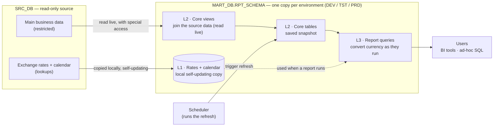
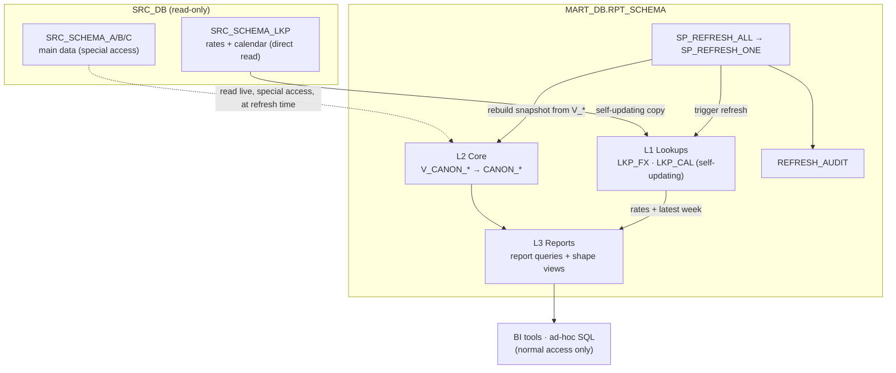
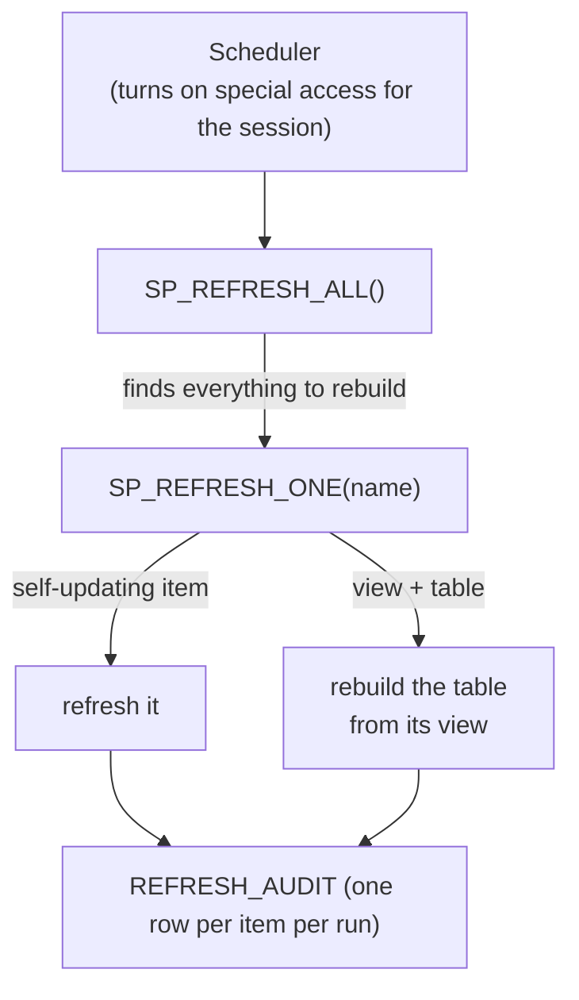
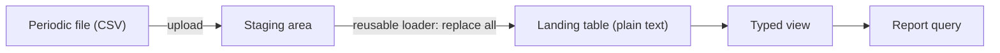
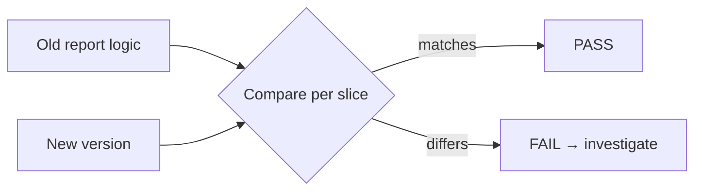

# Governed Reporting Data Mart on Snowflake

> A Snowflake reporting platform that rebuilds a suite of legacy finance reports
> as clean, version-controlled SQL — with automatic checks that the new numbers
> match the originals.

> **Portfolio note.** A production system I designed and built. Real object names
> are replaced with simple placeholders (`SRC_DB`, `MART_DB`, `RPT_SCHEMA`, …).

---

## 1. Problem & goals

**Problem.** A finance team depended on dozens of business-critical reports built
in an older reporting tool, where the logic was locked inside the tool's
interface: not visible, not reviewable, and hard to change or hand over. Because
those reports inform real decisions, any replacement had to return *exactly* the
same numbers while being far easier to understand, govern, and maintain.

**Goals.** Rebuild those reports on Snowflake, with all the logic written as plain
SQL kept in Git, so that the new system:

- gives the **same numbers as the old reports**, with automatic checks that prove they match;
- becomes the **one trusted source** for the data — it only reads from the source system, and Dev / Test / Prod are kept separate;
- is **fast and cost-efficient** — the heavy work is done once, and currencies are converted only when a report runs;
- lets people **get the data themselves**, without needing special access;
- is **easy to run and monitor** — a single refresh process, with every run logged.

**Scope:** about 5 reporting areas, ~40 reports, 8 core data models, and an
automated refresh + logging process. Built on Snowflake with SQL; everything
version-controlled in Git.

**Out of scope:** the platform never changes the source data (read-only); it is
not real-time (reports refresh daily/weekly); and there are no one-off custom
pipelines per report.

---

## 2. Naming legend (placeholders)

What each placeholder in this document refers to:

| Placeholder | What it is |
|---|---|
| `SRC_DB` | The source system we read from (read-only) |
| `SRC_SCHEMA_LKP` | The part of the source with exchange-rate and calendar lookups (we can read it directly) |
| `SRC_SCHEMA_A/B/C` | The parts of the source with the main business data (restricted — special access needed) |
| `MART_DB` | Our own database; a separate copy for each environment (`_DEV` / `_TST` / `_PRD`) |
| `RPT_SCHEMA` | The single area inside our database where everything lives |
| `CANON_*` | Our core, cleaned-up data tables (e.g. `CANON_REVENUE`, `CANON_WINS`) |
| `V_*` / `VS_*` | Views (saved queries) that define and shape the data |
| `LKP_FX`, `LKP_CAL` | Our local copies of the exchange-rate and calendar lookups |
| `ROLE_MART` | The access role that owns and reads our data |
| `ROLE_SRC_READ` | The special access role needed to read the restricted source |
| `WH_LOAD` | The compute engine used to build and refresh the data |
| `FN_FX(amount, rate)` | A small function that converts an amount into another currency |
| `SP_REFRESH_ALL` / `SP_REFRESH_ONE` | The routines that rebuild the data |
| `REFRESH_AUDIT` | A log table that records every refresh |

---

## 3. Architecture & design

The platform sits between the read-only source and the people using the reports.
Inside one area of our database it has three simple layers, and there is a full,
separate copy for each environment (Dev / Test / Prod).

Almost nothing is copied into the platform. Only two things are actually stored:
our core tables (a saved snapshot of each model) and a local copy of the
exchange-rate and calendar lookups. The large source tables are read live while
we rebuild, never duplicated, and currency conversion happens when a report runs
rather than being stored.

| Layer | What it holds | How it's built |
|---|---|---|
| **L1 Lookups** | Local copies of exchange rates + calendar | Update themselves automatically |
| **L2 Core models** | 8 cleaned tables, one per source area | Rebuilt by a routine that saves a snapshot of the view |
| **L3 Reports** | Report queries (and light "shape" views) | Plain SQL that users run |

**Key principles**

- Each core table stays at the same level of detail as its source, so totals can't accidentally change when descriptive columns are added.
- Amounts are stored in their original currency; conversion happens at report time, so one table can serve any currency.
- Users only ever read our own area — they never need special access to the source.
- Each environment (Dev / Test / Prod) is a full, independent copy; they don't affect each other.

Each model is a **pair**: a *view* (a saved query that holds the logic) and a
*table* (a stored snapshot that people read). The table can't refresh itself
automatically, because reading the restricted source needs special access that
Snowflake's automatic-refresh features don't support. So a small routine, run with
that access, rebuilds the table from the view. To keep it fast, the view also
**summarises the large source table first, then adds the descriptive columns**, so
the wide source data isn't carried through every join.

### Why we keep our own copy

The source only lets us read it through locked-down views: read-only, and
reachable only with special access. That takes away almost everything we'd need to
make reporting fast, reliable, and easy to change. Copying the data into tables we
own turns that limited, hidden dependency into data we fully control.

| | Reading the source directly | Keeping our own copy |
|---|---|---|
| **Control** | Read-only; can't change or tune anything | We own the tables and can shape and manage them |
| **Speed** | No way to tune for performance | We arrange the data around how reports filter it, so queries stay fast |
| **Refresh** | Can't refresh automatically | We control when and how it rebuilds |
| **Reliability** | Numbers could shift while a report is running | Each rebuild is a clean snapshot — stable, repeatable |
| **Access** | Needs special source access | People read normal tables; no special access |

Owning the data also makes performance a deliberate choice: we store rows in the
order reports tend to read them, so the engine can skip the parts it doesn't need;
we do the expensive joining once rather than on every query; and we avoid bloating
storage by converting currency only when a report runs.

---

## 4. Data flow & access

Data gets into the platform in two ways, depending on how each part of the source
can be read:

| What | From | How it gets in | When it refreshes |
|---|---|---|---|
| **Lookups** (rates, calendar) | readable directly | copied into local tables | automatically |
| **Core tables** | restricted source | a routine reads the source and saves a snapshot | when the refresh runs |

Access is the biggest design driver. The restricted source can only be read with a
special add-on access role, and **only the rebuild process uses it**. Everyday
users read our finished tables, so **they never need that special access**. And
because we can only read (not change) the source lookups, we copy them in full
each time rather than just the changes.

---

## 5. Refresh & orchestration

- `SP_REFRESH_ALL` finds everything that needs rebuilding on its own. Add a new model that follows the naming convention and it's picked up with no code changes.
- `SP_REFRESH_ONE` rebuilds a single item on its own, for a targeted fix or partial recovery.
- Every rebuild writes a log row: what ran, how long it took, how many rows, and whether it succeeded or failed.
- An external scheduler runs it, because our access role isn't permitted to schedule jobs inside Snowflake. Moving to Snowflake's built-in scheduling later would be a small change.

---

## 6. External file loads

Some data doesn't come from the main source — it arrives as a file (for example, a
CRM or HR export). These follow a separate, simple path:

- Everything loads as **plain text first**, so a bad or empty value never breaks the load; the correct data types are applied afterwards in a view.
- Each load **fully replaces** the previous file's data, while keeping all access settings intact.
- **One reusable loader** handles any file, so a new file type only needs a table and a view — no new code.

---

## 7. Quality & validation

Every report comes with a check that runs the old logic and the new version side
by side and reports **PASS or FAIL** for each slice (for example, each year). This
turns "the numbers match the old report" into something we actually prove — and it
catches any accidental change later on.

